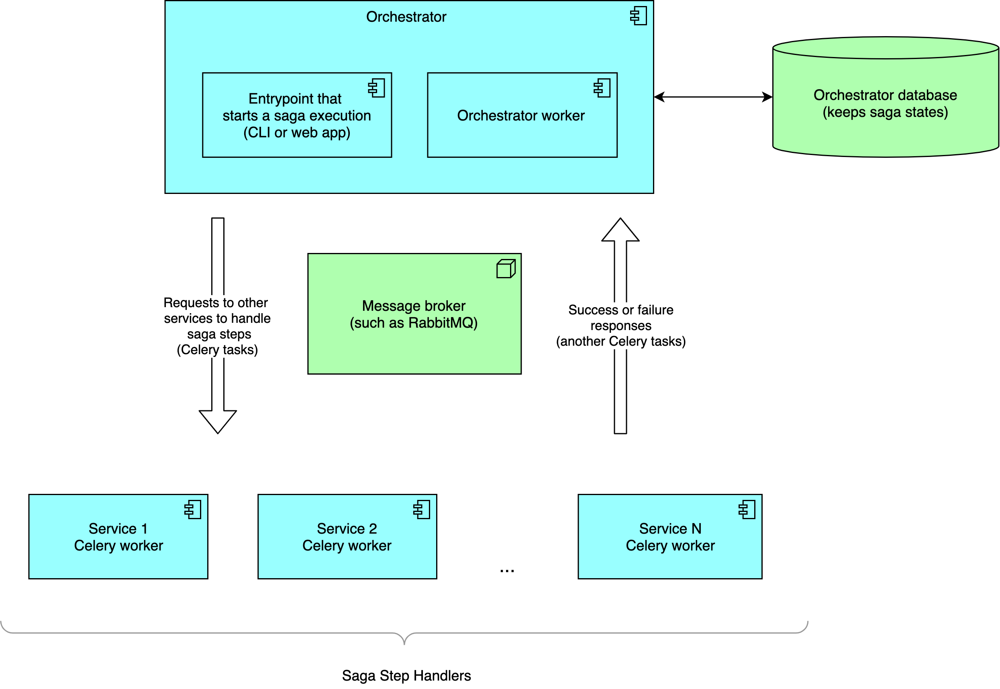

Saga Framework for Microservices
====
- [What is it](#what-is-it)
- [Implementation notes](#implementation-notes)
  * [Main solution components](#main-solution-components)
  * [Basics: synchronous sagas](#basics-synchronous-sagas)
  * [Closer to reality: asynchronous sagas](#closer-to-reality-asynchronous-sagas)
    + [Registering response handlers for Orchestrator](#registering-response-handlers-for-orchestrator)
  * [Keeping saga states - must-have in practice](#keeping-saga-states---must-have-in-practice)
    + [Note on Repository pattern in StatefulSaga](#note-on-repository-pattern-in-statefulsaga)
  * [AsyncAPI integration](#asyncapi-integration)
  * [Real-world example](#real-world-example)
- [Development](#development)
  * [Setup](#setup)
  * [Build](#build)
  * [Upload to PyPi](#upload-to-pypi)
    
# What is it
It's first Python framework implementing Saga pattern ("orchestration" flavour) for microservices.

Treat it as a Python alternative of [Eventuate Tram Sagas library](https://eventuate.io/docs/manual/eventuate-tram/latest/getting-started-eventuate-tram-sagas.html)
 that's promoted in [Chris Richardson book on Microservices](https://microservices.io/book)

What's cool there:
 * Framework-agnostic
 * Saga state keeping (with `StatefulSaga` class)
 * Celery integration
 * [AsyncAPI](https://www.asyncapi.com/) integration  
 * [Practical usage example](https://github.com/absent1706/saga-demo) (`CreateOrder` saga from [Chris Richardson book on Microservices](https://microservices.io/book))
 * Well-structured: has 3 Saga classes with increasing set of features (`BaseSaga`, `AsyncSaga`, `StatefulSaga`)    

# Implementation notes 

## Main solution components

**Orchestrator** is main service which consists of 2 components:
 * entrypoint - CLI or web app that has an interface (console command or API) that can launch a saga execution (which, in most cases, means placing a first Celry) 
 * worker - catches responses from Saga Step Handler services and launches next saga step or, if there was a failure, rolls back a saga
 * (in most cases) database where saga states are kept (see [StatefulSaga](#statefulsaga) for more details)

**Saga Step Handler Services** are services which actually perform saga steps (such as validating a customer or charging a credit card).
They receive Celery tasks from Orchestrator and report results back (via another Celery tasks like `{base task name}.response.success`). 

**Message Broker** is actually transport for communication between Orchestrator and Saga Step Handler Services.



To see architecture explanation on example, visit [demo repository](https://github.com/absent1706/saga-demo).


Let's now move to what current framework has to offer.

There're three Saga classes covering use cases from trivial (`BaseSaga`) to real-world ones (`StatefulSaga`)


## Basics: synchronous sagas 
> See implementation at [base_saga.py](saga_framework/base_saga.py).

Framework backbone is the simplest Saga class which is an analogue of [saga_py](https://github.com/flowpl/saga_py)

```python
class Saga(BaseSaga):
    def __init__(self, *args, **kwargs):
        super().__init__(*args, **kwargs)

        self.steps = [
            SyncStep(
                name='step_1',
                compensation=step_1_compensation_mock
            ),
            SyncStep(
                name='step_that_fails',
                action=failing_action_mock
            ),
            SyncStep(
                name='step_2',
                action=step_2_action_mock,
                compensation=step_2_compensation_mock
            )
        ]

    on_saga_success = on_saga_success_mock
    on_saga_failure = on_saga_failure_mock

###### how to use this class #####
fake_saga_id = 123
Saga(fake_saga_id).execute()

```
As simple as that.
Determine saga steps and run them.

## Closer to reality: asynchronous sagas
> See implementation at [async_saga.py](saga_framework/async_saga.py).

Here's where the story begins.

In real world, Saga steps are handled by other microservices which Orchestrator service launches
by means of sending a message to message broker (in case of Python, it will correspond to sending Celery task).

When other service (let's call it Saga Step Handler) receives a message (Celery task), 
 it runs some business logic (e.g., Accounting service will charge a given customer).
After that, it responds back by means of sending another message to a broker (in Python, it means sending another Celery task).

Orchestrator listens to such messages (it has its own Celery worker for that) and:
 * for success responses (here they look like `{base_task_name}.response.success`), launches next saga step
 * for failure responses (here they look like `{base_task_name}.response.failure`), rolls back a saga

This framework has all tools needed to implement such a complex flow:
 * `AsyncSaga` and `AsyncStep` classes - support sending Celery tasks to Saga Step Handler microservices
 * `saga_step_handler` - decorator for Celery task for usage in Saga Step Handler services. Sends `{base_task_name}.response.success` or `{base_task_name}.response.failure` Celery task automatically

In addition, there're some bells and whistles:
 * custom `on_success` and `on_failure` callbacks in `AsyncStep` class which are called when corresponding step succeeds or fails
 * `auto_retry_then_reraise` decorator for Celery task. Has no relation to Sagas per se, but is useful because sometimes it's needed to retry Celery task few times and only then fail

Here's a usage example of `AsyncSaga` and `AsyncStep` (see [a real usage example here](https://github.com/absent1706/saga-demo))
```python
class Saga(AsyncSaga):
    def __init__(self, *args, **kwargs):
        super().__init__(*args, **kwargs)

        self.steps = [
            SyncStep(
                name='step_1',
                compensation=step_1_compensation_mock
            ),
            AsyncStep(
                name='step_2',
                action=step_2_action_mock,

                queue='some_queue',
                base_task_name='step_2_task',
                on_success=step_2_on_success_mock,
                on_failure=step_2_on_failure_mock
            ),
            SyncStep(
                name='step_3',
                action=step_3_action_mock
            ),
        ]
```


Here's a usage example of Saga Step Handler (using `saga_step_handler` and `auto_retry_then_reraise` decorators).
See more at [a real usage example repo](https://github.com/absent1706/saga-demo)
```python
@command_handlers_celery_app.task(
    bind=True, name=approve_ticket_message.TASK_NAME,
    default_retry_delay=5  # set some small retry delay to not wait 3 minutes Celery sets by default
)
@saga_step_handler(response_queue=CREATE_ORDER_SAGA_RESPONSE_QUEUE)
@auto_retry_then_reraise(max_retries=2)  # retry task 2 times, then re-raise exception
def approve_ticket_task(self: Task, saga_id: int, payload: dict) -> typing.Union[dict, None]:
    request_data = approve_ticket_message.Payload(**payload)

    # emulate 30%-probable first-time failure
    if random.random() < 0.3:
        raise EnvironmentError('test error message. Task will retry now')

    # in real world, we would change ticket status to 'approved' in service DB
    logging.info(f'Restaurant ticket {request_data.ticket_id} approved')

    return None
```

### Registering response handlers for Orchestrator
As mentioned above, Orchestrator service listens for responses from Saga Step Handler services.
For example, if Orchestrator sent message (read "Celery task") named `restaurant_service.approve_ticket` to Saga Step Handler (say, Restaurant Service),
 it will expect to get success response a message (Celery task) named `restaurant_service.approve_ticket.response.success` or `restaurant_service.approve_ticket.response.failure`.

This is true for all `AsyncStep`'s in saga.

So, for each Celery task Orchestrator sends, we need it to listen for responses which are Celery tasks theirselves.

For that, framework has `AsyncSaga.register_async_step_handlers` method that automatically registers all response listeners.

For example (see more at [a real usage example repo](https://github.com/absent1706/saga-demo)):

```python
from celery import Celery
from saga_framework import close_sqlalchemy_db_connection_after_celery_task_ends

from order_service.app_common import settings
from order_service.app_common.messaging import CREATE_ORDER_SAGA_RESPONSE_QUEUE
from .app import CreateOrderSaga, db

create_order_saga_responses_celery_app = Celery(
    'create_order_saga_responses',
    broker=settings.CELERY_BROKER)
create_order_saga_responses_celery_app.conf.task_default_queue = CREATE_ORDER_SAGA_RESPONSE_QUEUE

close_sqlalchemy_db_connection_after_celery_task_ends(db.session)  # SQLAlchemy-specific: we need to close SQLAlchemy session after each Celery task run 

CreateOrderSaga.register_async_step_handlers(create_order_saga_responses_celery_app)
```


## Keeping saga states - must-have in practice
> See implementation at [stateful_saga.py](saga_framework/stateful_saga.py).

It's very useful to keep information about ongoing and finished Sagas in database, 
so one will know:
 * which Sagas are running right now
 * what step is each saga on
 * which Sagas were completed
 * which Sagas were failed and with what specific error

Let's keep such information in entity called `SagaState`.

For example, `SagaState` table/entity for CreateOrderSaga from [Chris Richardson book on Microservices](https://microservices.io/book) 
can look like (SQLAlchemy example, see more at [saga-demo repo](https://github.com/absent1706/saga-demo)):  

```python
class CreateOrderSagaState(BaseModel):
    id = db.Column(db.Integer, primary_key=True)
    last_message_id = db.Column(db.String)
    
    created_at = db.Column(db.TIMESTAMP(timezone=False),
                           default=sa.func.now(),
                           nullable=False)

    updated_at = db.Column(db.TIMESTAMP(timezone=False),
                           default=sa.func.now(),
                           onupdate=sa.func.now(),
                           nullable=False)


    status = db.Column(db.String, default='not_started')
    failed_step = db.Column(db.String)
    failed_at = db.Column(db.TIMESTAMP)
    failure_details = db.Column(db.JSON)

    # Fields specific for CreateOrderSaga
    order_id = db.Column(db.Integer, db.ForeignKey('order.id'))
    order = db.relationship("Order")
```

To support updating `SagaState` in database, `saga_framework` offers `StatefulSaga` class 
which will call an instance of `AbstractSagaStateRepository` subclass to save Saga State 
 in a manner defined by repository:
```python

class StatefulSaga(AsyncSaga, abc.ABC):
    def __init__(self, saga_state_repository: AbstractSagaStateRepository, celery_app: Celery, saga_id: int):
        self.saga_state_repository = saga_state_repository
        super().__init__(celery_app, saga_id)

    @property
    def saga_state(self):
        if not self._saga_state:
            self._saga_state = self.saga_state_repository.get_saga_state_by_id(self.saga_id)

        return self._saga_state

    def run_step(self, step: BaseStep):
        self.saga_state_repository.update_status(self.saga_id, status=f'{step.name}.running')
        super().run_step(step)

    def compensate_step(self, step: BaseStep, initial_failure_payload: dict):
        self.saga_state_repository.update_status(self.saga_id, status=f'{step.name}.compensating')
        super().compensate_step(step, initial_failure_payload)
        self.saga_state_repository.update_status(self.saga_id, status=f'{step.name}.compensated')

    def on_step_success(self, step: AsyncStep, *args, **kwargs):
        self.saga_state_repository.update_status(self.saga_id, status=f'{step.name}.succeeded')
        super().on_async_step_success(step, *args, **kwargs)

    def on_step_failure(self, failed_step: AsyncStep, payload: dict):
        self.saga_state_repository.update_status(self.saga_id, status=f'{failed_step.name}.failed')
        super().on_async_step_failure(failed_step, payload)

    def on_saga_success(self):
        super().on_saga_success()
        self.saga_state_repository.update_status(self.saga_id, 'succeeded')

    def on_saga_failure(self, *args, **kwargs):
        super().on_saga_failure(*args, **kwargs)
        self.saga_state_repository.update_status(self.saga_id, 'failed')
```

Here's an example of such repository for CreateOrderSaga using SQLAlchemy and [SQLAlchemy-mixins](https://github.com/absent1706/sqlalchemy-mixins)
(see more at [Saga demo repo](https://github.com/absent1706/saga-demo)):
```python
class CreateOrderSagaRepository(AbstractSagaStateRepository):
    def get_saga_state_by_id(self, saga_id: int) -> CreateOrderSagaState:
        # ActiveRecord pattern for SQLAlchemy is used,
        # see https://github.com/absent1706/sqlalchemy-mixins
        return CreateOrderSagaState.find(saga_id)  

    def update_status(self, saga_id: int, status: str) -> CreateOrderSagaState:
        # ActiveRecord pattern for SQLAlchemy is used,
        # see https://github.com/absent1706/sqlalchemy-mixins     
        return self.get_saga_state_by_id(saga_id).update(status=status)

    def update(self, saga_id: int, **fields_to_update: str) -> object:
        return self.get_saga_state_by_id(saga_id).update(**fields_to_update)

    def on_step_failure(self, saga_id: int, failed_step: BaseStep, initial_failure_payload: dict) -> object:
        return self.get_saga_state_by_id(saga_id).update(
            failed_step=failed_step.name,
            failed_at=datetime.datetime.utcnow(),
            failure_details=initial_failure_payload
        )
```

Here's an example of `SagaState` table:


### Note on Repository pattern in StatefulSaga

`Repository` pattern allows to use any ORM:
 * see full Flask+SQLAlchemy example above and in [Saga demo repo](https://github.com/absent1706/saga-demo)
 * example for Django ORM is not implemented yet, but it should be trivial: you just need to inherit from `AbstractSagaStateRepository` and implement all required abstract methods where you should just work with Django ORM models as regular


## AsyncAPI integration
> See implementation at [asyncapi_utils.py](saga_framework/asyncapi_utils.py).

In REST, we have Swagger / OpenAPI.
In async messaging, alternative is [AsyncAPI standard](https://www.asyncapi.com/) 
which provides its own IDL (interface definition language) for describing messages between various services.

The current framework offers integration with [AsyncAPI standard](https://www.asyncapi.com/) and
[asyncapi-python library](https://github.com/dutradda/asyncapi-python) which helps to generate AsyncAPI specifications from Python code.

Simply saying, the current framework offers a set of utilities that allow to use [asyncapi-python library](https://github.com/dutradda/asyncapi-python) even more easy:
 * easily generate `asyncapi.Message` objects (from [asyncapi-python library](https://github.com/dutradda/asyncapi-python)) for Saga Step Handler responses (`asyncapi_message_for_success_response`,`asyncapi_message_for_failure_response` functions)
 * convert AsyncAPI messages to channels and components (AsyncAPI standard has too many various entities, so some of them can be computed from message entity to not make developers write tons of repeatable code)
 * generate some fake information about AsyncAPI servers - a completely optional thing which is however required by [asyncapi-python library](https://github.com/dutradda/asyncapi-python)

See full usage example in [demo repository](https://github.com/absent1706/saga-demo).

## Real-world example
See real-world example at [https://github.com/absent1706/saga-demo](https://github.com/absent1706/saga-demo).

It contains an implementation of CreateOrderSaga from [Chris Richardson book on Microservices](https://microservices.io/book)

# Development
See more at https://packaging.python.org/tutorials/packaging-projects/

## Setup
`pip3 install -r requirements.dev.txt`

## Build
Specify version in `setup.py`, then

```
python3 setup.py sdist bdist_wheel
twine check dist/*
```

## Upload to PyPi
```
twine upload dist/*
```

